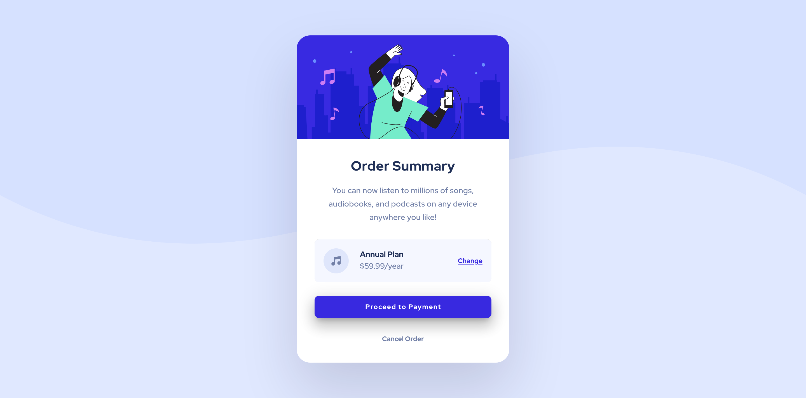

# Frontend Mentor - Order summary card solution

This is a solution to the [Order summary card challenge on Frontend Mentor](https://www.frontendmentor.io/challenges/order-summary-component-QlPmajDUj). Frontend Mentor challenges help you improve your coding skills by building realistic projects.

## Table of contents

- [Overview](#overview)
  - [Screenshot](#screenshot)
  - [Links](#links)
- [My process](#my-process)
  - [Built with](#built-with)
- [Author](#author)
- [Project setup](#project-setup)

## Overview

### Screenshot




### Links

- Solution URL: [solution](https://github.com/nguyensylvie/order-summary)
- Live Site URL: [live site](https://order-summary-nguyensylvie.netlify.app/)

## My process

### Built with

- Vuetify
- CSS

## Author

- Frontend Mentor - [@nguyensylvie](https://www.frontendmentor.io/profile/nguyensylvie)

## Project setup

```
# yarn
yarn

# npm
npm install

# pnpm
pnpm install
```

### Compiles and hot-reloads for development

```
# yarn
yarn dev

# npm
npm run dev

# pnpm
pnpm dev

```
